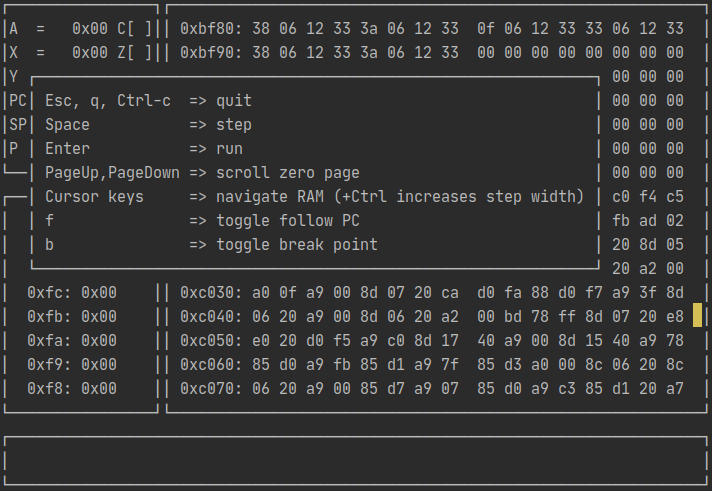

# node-nes

An emulator of the Nintendo Entertainment System. It is still work in progress.
This project only serves educational purpose for my while learning Node.js.\
The main goal of this project is to learn best practices for such a typical Node.js project like structure, design and testing.

## Resources

* https://wiki.nesdev.com
* http://www.6502.org/tutorials/6502opcodes.html

## Tests

Use `npm test` to perform `nestest` self-test. A rom file will be executed in auto mode.

## Debugger

For a more interactive "experience" use `npm run debugger -- path/to/rom.nes`. This will start a terminal based application shown below.

Features:

* CPU register view
* zero-page view
* RAM view
  * navigate by your own
  * highlight of program counter
  * follow program counter
  * manage break points
* step-by-step
* go-mode (until it crashes)
* stop on break points

While hitting Enter it will execute the loaded rom as fast as possible. But try holding Space.
Nothing is more satisfying than this blinking on the screen, like in Matrix and claiming that you only see blondes, brunettes and redheads.